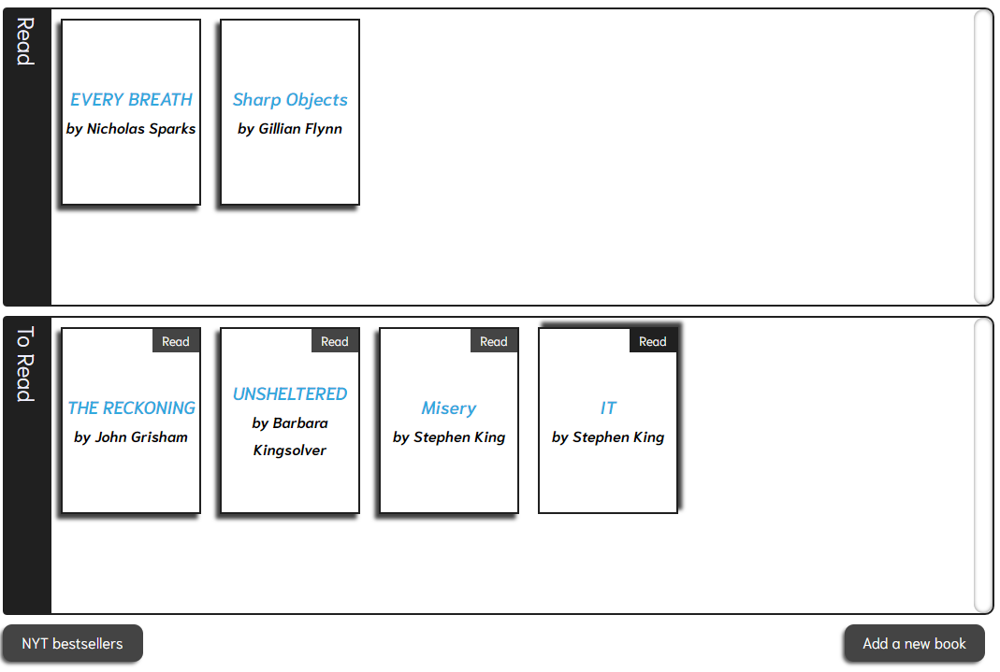
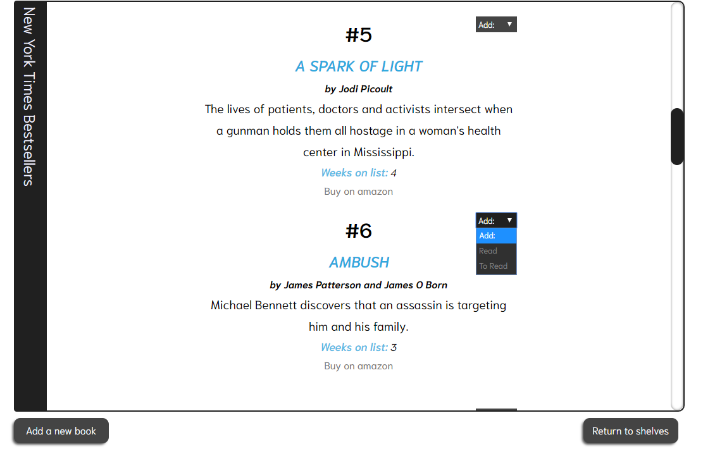
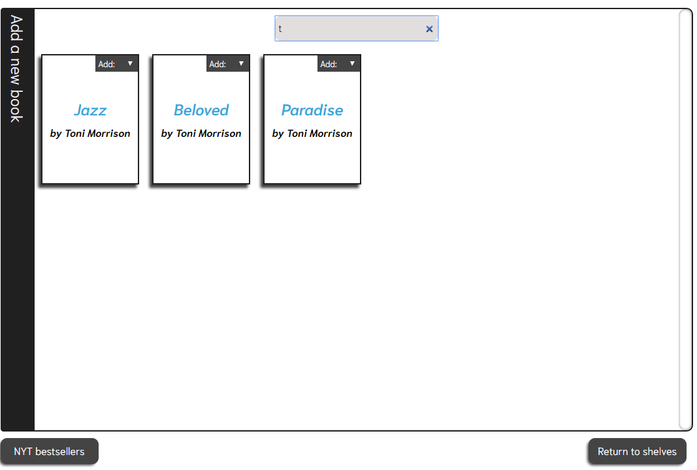

# My Bookcase
>The purpose of "My Bookcase" app is to allow the user to maintain her/his read and to-read books.

## Table of contents
* [General info](#general-info)
* [Screenshots](#screenshots)
* [Technologies](#technologies)
* [Setup](#setup)
* [Features](#features)
* [Status](#status)
* [Contact](#contact)

## General info
This is my first app created with React.js. It allows the user to add books from NYT bestsellers' list (NYT books API),and firebase database collection,to "Read"/"To Read" shelves, as well as move the chosen titles between the shelves.

## Screenshots
Bookshelves panel

NYT bestsellers panel

Books database panel

## Technologies
* JavaScript - ECMAScript 6
* React.js - version 16.5.2
* Axios - version 0.18.0
* Firebase - version 5.5.5
* SASS

## Setup

## Features
List of features ready and TODOs for future development
* Moving books between shelves
* Access to NYT's bestsellers API
* Access to firebase database
* Search by one letter

To-do list:
* Improvement of the visual side of the app

## Status
Project is: _in progress_

I'm still improving my code,and adding visual/functional features to my project.

## Contact
Created by [@magdalenafronczyk](https://www.linkedin.com/in/magdalena-fronczyk-734685166/) - feel free to contact me!